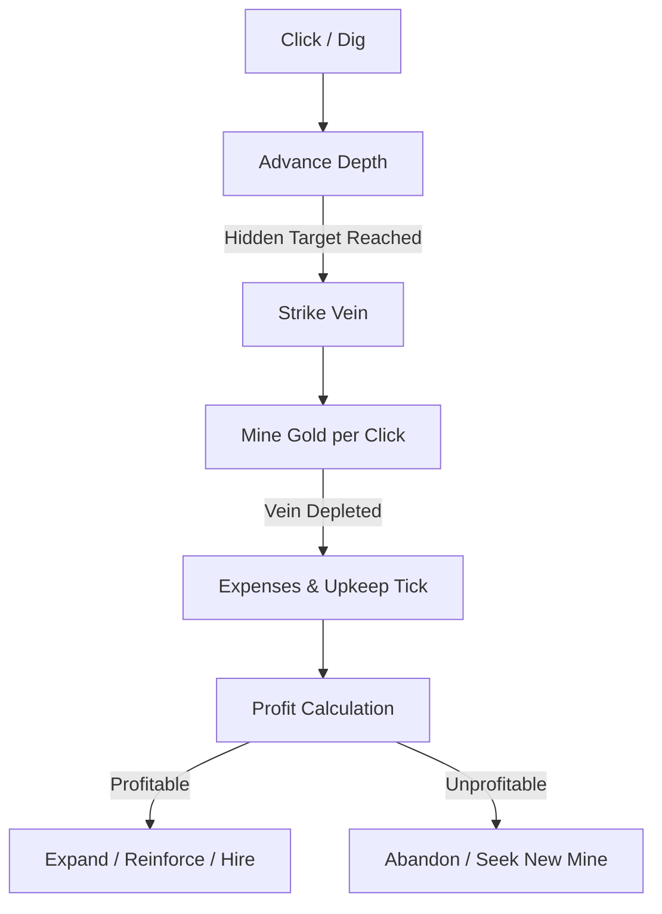

# 🪙 Draconia Chronicles — Gold Mining Economy Subsystem (v1.0)

**Version:** 1.0  
**Date:** 2025-11-10  
**Status:** Approved for integration (Side-System / City-Meta)  
**Author:** Draconia Team  

---

## 1. Overview

The **Gold Mining Mini-Game** expands Draconia’s world economy beyond the Arcana-based combat loop.  
It represents the *civil and economic side of dragonkind*: exploration, industry, and stewardship.

### Purpose
- Introduces **risk-reward economics** and **non-infinite scaling**.
- Bridges **clicker gameplay** with **simulation management**.
- Encourages **multiple mines** instead of infinite depth.
- Adds **maintenance, payroll, research, and sustainability** systems that mirror real-world industrial balance.

### Context
Mining is considered a **secondary side-game** accessible from the City of Draconia.  
It runs asynchronously (like Synth or Research) but can also be played interactively via clicker mechanics.

---

## 2. Lore & Narrative Hooks

### 2.1 Mythic Origin
Beneath Draconia lie ancient veins of gold and **Aethermetal**, remnants of the gods’ first forges.  
Mining them is both **profitable** and **dangerous** — the earth remembers the heat of creation.

### 2.2 The Guild of Deep Flame
A guild of engineers and economists who regulate extraction to prevent another *Collapse of the Hollow Spire*.
Their motto:  
> “Gold must flow — but the mountain must breathe.”

### 2.3 Player Role
The player acts as a **Mine Overseer**, sanctioned by the Guild to open and manage mines across the Dragonlands.  
Each mine represents a **business venture** with profits, losses, and risk.

---

## 3. Core Gameplay Flow



---

## 4. Prospecting Mechanics

### 4.1 Vein Discovery
- Each click represents one **dig action**.
- A **hidden `targetDistance`** determines when the next vein is found.
- The target resets after each vein is mined.

| Variable | Description | Suggested Range |
|-----------|--------------|-----------------|
| `targetDistance` | Hidden clicks until vein | 25–100 |
| `depth` | Current progress | 0 → targetDistance |
| `veinYield` | Total gold in vein | 10–100 |
| `mineRate` | Gold per click while vein active | 1–5 |
| `minerAssistChance` | Auto-advance chance per miner | 1–50% |
| `pityLimit` | Guaranteed find after X clicks | 100 |

### 4.2 Example Pseudocode
```ts
if (!activeVein) {
  targetDistance = randomInt(25, 100);
  depth = 0;
}
depth++;
if (depth >= targetDistance) {
  activeVein = { goldRemaining: randomInt(10, 100) };
}
if (activeVein) {
  goldGained = min(mineRate, activeVein.goldRemaining);
  activeVein.goldRemaining -= goldGained;
  if (activeVein.goldRemaining <= 0) activeVein = null;
}
```

### 4.3 Balance Intent
Average “strike” every **30–45 s** of active clicking.  
Early play feels *lucky and exciting*, late play becomes *logistical and automated*.

---

## 5. Automation & Workforce

### 5.1 Roles
| Role | Function | Cost | Notes |
|------|-----------|------|-------|
| **Miner** | Auto-clicks & discovers veins | Wage per minute | Base labor |
| **Foreman** | Boosts miner output | 10× miner wage | Reduces inefficiency |
| **Engineer** | Reduces machine upkeep | 8× miner wage | Adds reliability |
| **Manager** | Controls up to N miners | High cost | Prevents wage inflation |
| **Geologist** | Increases chance to find veins early | Flat salary | “Search” specialist |

### 5.2 Automation Rules
- **Miners** advance depth automatically every few seconds.
- **Foremen/Managers** reduce the total payroll curve.
- **Engineers** slow tool decay & downtime.
- **Geologists** shift RNG toward shallower target distances.

---

## 6. Upgrades

| Category | Upgrade | Effect | Cost |
|-----------|----------|---------|------|
| **Tools** | Sharper Pick, Steel Pick, Diamond Drill | +GPC, faster mining | 25 → 10 000 G |
| **Machines** | Drill Rig, Steam Engine, Laser Extractor | +GPS, higher upkeep | 10 000 → 1 B |
| **Infrastructure** | Tunnel Supports, Air Pumps, Reinforced Rails | +Stability, lower decay | 1 000 → 500 M |
| **Research** | Geological Sensors, Arcana-Fusion Power | Increases find rate, lowers upkeep | 5 000 G → 2 B |
| **Luxury** | Cafeteria, Rest Quarters, Mascot | Worker morale → +5% output | Cosmetic + minor buff |

---

## 7. Economic Model

### 7.1 Revenue & Expenses
```ts
income = goldPerSecond;
expenses =
  (minerWage * miners)
+ (managerWage * managers)
+ (toolUpkeep * tools)
+ (machineUpkeep * machines)
+ (tunnelDecay * depth);

profit = income - expenses;
```

### 7.2 Typical Ratios
| Depth Band | Income | Expenses | Net Margin | State |
|-------------|---------|-----------|-------------|--------|
| 0–50 m | 100 | 10 | +90 | Stable |
| 50–150 m | 500 | 200 | +300 | Growth |
| 150–300 m | 2 000 | 1 800 | +200 | Tight margin |
| 300 m+ | 5 000 | 6 000 | −1 000 | Unsustainable |

### 7.3 Upkeep Systems
| System | Description | Cost Driver |
|---------|--------------|--------------|
| **Payroll** | Miner + Manager wages | headcount |
| **Maintenance** | Tool & machine decay | tool age |
| **Infrastructure** | Tunnel stability upkeep | depth |
| **Engineering** | Research & safety | tier |
| **Power** | Fuel or Arcana generators | machine count |

---

## 8. Risk & Failure States

| Risk Event | Trigger | Effect |
|-------------|----------|--------|
| **Cave-in** | Low stability | Lose % of depth & miners |
| **Equipment Failure** | Neglected maintenance | Halt production temporarily |
| **Worker Strike** | Negative profit too long | Output −50% |
| **Collapse Threshold** | Stability ≤ 10% | Forced mine closure |
| **Debt Spiral** | Profit < 0 for 3 m straight | Auto-liquidate mine |

---

## 9. Expansion & Exploration

### 9.1 The Journey Layer
When a mine becomes unprofitable:
1. Player **abandons or mothballs** the old site.  
2. Embarks on a **journey** (exploration mini-sequence) to find a new vein field.  
3. Discovers a **new mine** with random:
   - Vein richness (yield multiplier)
   - Rock hardness (depth multiplier)
   - Terrain modifiers (risk multiplier)

### 9.2 Incentive
Multiple small mines outperform one endless pit.  
Each new region ties into Draconia’s world map and lore.

---

## 10. Profit Curves & Scaling

### 10.1 Curves
- **Income Growth:** `income = base * depth^1.2`
- **Expense Growth:** `expenses = base * depth^1.35`
- Break-even typically around 250–300 m.

### 10.2 Stability Curve
`stabilityLoss = (depth / 100)^1.25 × (1 − engineerBonus)`

### 10.3 Repair Loop
Players can temporarily **reinforce** mines (pay gold or resources) to restore stability:
- Quick fix: +10% stability for 5% current cash
- Full reinforce: +50% stability for 25% cash + materials

---

## 11. Risk–Reward Philosophy

| Depth | Risk | Reward | Strategy |
|--------|------|--------|-----------|
| Shallow | Low | Low | Safe, early game |
| Mid | Medium | Medium | Balanced scaling |
| Deep | High | High | Needs engineers |
| Abyssal | Extreme | Variable | Temporary gains only |

Players learn that **stability, management, and restraint** matter as much as speed.

---

## 12. Expansion Hooks

### 12.1 Integration with City Meta
- **Guild Licenses**: pay Arcana + Gold to open new mines.
- **Arcana Exchange**: convert mined gold into Arcana via refinery.
- **Research Lab**: unlock deeper tiers with Soul Power.
- **Market System**: gold from mines feeds city economy and civic donations.

### 12.2 Cross-System Hooks
| System | Hook |
|---------|------|
| **Arcana** | Used to power drills and stabilize deeper tunnels |
| **Soul Power** | Required to unlock new mine types |
| **Astral Seals** | Cosmetic gear, premium miners, or visual effects |
| **City Market** | Gold → Taxes; high profits increase civic economy |
| **Telemetry** | Tracks profit trends per mine for analytics |

---

## 13. Player Experience Goals

1. **Agency:** Player feels ownership of each mine’s fate.  
2. **Rhythm:** Alternation between clicking, management, and expansion.  
3. **Tension:** Profit margins shrink as depth increases.  
4. **Payoff:** Striking a rich vein feels euphoric.  
5. **Learning:** Player develops intuition for sustainability.  

---

## 14. Accessibility & A11y

- Tooltips for each expense type.  
- Visual color coding: green = profit, red = loss, yellow = risk.  
- Reduced-motion drilling mode.  
- Adjustable click frequency caps (anti-strain).  

---

## 15. Future Expansion Ideas

- **Co-op Mines** (shared operations between players).  
- **Seasonal Events:** comet shards embedded in ore (Astral Seal drops).  
- **Runic Engineering Tree:** unlock runic drills, aether pumps, or molten channels.  
- **Economy Events:** inflation, demand spikes, black markets.  
- **Disasters:** magical tremors, corrupted gold veins, awakening of ancient entities.

---

## 16. Summary

> The Gold Mining Economy turns idle clicking into strategic industrial management.  
> Every gain has a cost; every expansion demands stability.  
> Greed alone cannot conquer the depths — only **balance, foresight, and leadership** can.

---

**End of Document — GOLD_MINING_ECONOMY_SPEC_v1.0**
